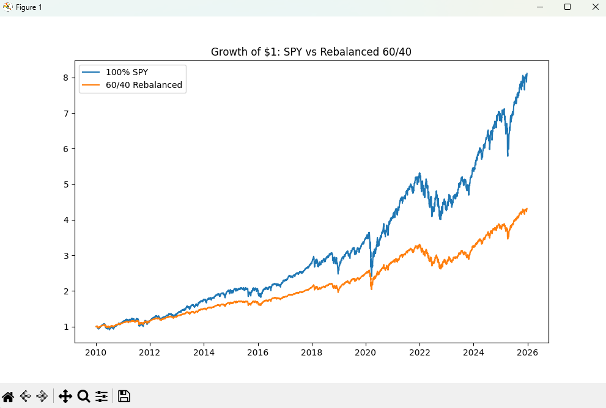

# Portfolio Risk & Performance Analysis

This project analyzes the historical performance and risk characteristics of two portfolios:
- **100% SPY** (U.S. Equity Portfolio)
- **60/40 Portfolio** (60% SPY, 40% Bonds)

The goal is to compare absolute returns versus **risk-adjusted performance** and evaluate downside risk using both historical data and Monte Carlo simulation.

---

## Metrics Computed
- Arithmetic Annual Return
- Compound Annual Growth Rate (CAGR)
- Annualized Volatility
- Sharpe Ratio
- Maximum Drawdown

---

## Historical Analysis

Using historical daily price data, portfolio returns and equity curves are constructed and evaluated.

### Key Findings
- The **60/40 portfolio achieves a higher Sharpe Ratio**, indicating superior **risk-adjusted returns** despite lower absolute exposure to equities.
- Diversification through bonds significantly reduces portfolio volatility.
- Maximum drawdowns are comparable across portfolios, demonstrating that lower volatility does not necessarily eliminate downside risk.
- The difference between arithmetic returns and CAGR highlights the impact of **volatility drag** and compounding effects.

---

## Monte Carlo Simulation

To assess potential future outcomes, a Monte Carlo simulation is implemented to model **10,000 possible 10-year portfolio paths**.

### Methodology
- Daily portfolio returns are modeled using a normal distribution calibrated to historical mean and volatility.
- Simulated returns are compounded to generate future equity paths.
- The distribution of terminal portfolio values is analyzed to evaluate downside risk.

### Key Risk Insights
- The **median (50th percentile)** outcome reflects the expected long-term growth path of the portfolio.
- The **worst 5% of outcomes** provide an estimate of severe downside scenarios.
- The **probability of capital loss** after 10 years is estimated, illustrating long-horizon risk characteristics of a diversified portfolio.

This analysis highlights how diversification and compounding influence long-term risk, while also acknowledging that normal return assumptions understate extreme tail risk.

---

## Visualization

---

## Tools & Libraries
- Python
- pandas
- numpy
- matplotlib
- yfinance
